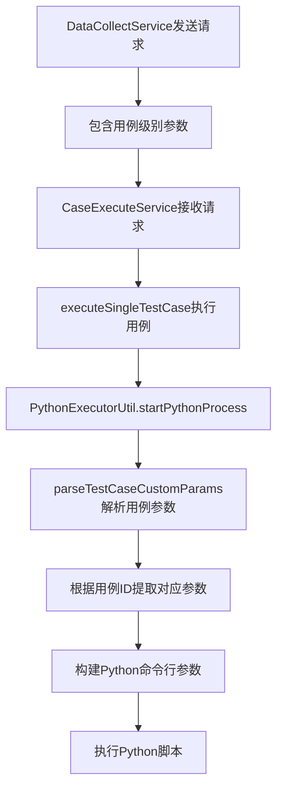

# 用例级别自定义参数解析功能说明

## 功能概述

本次改进实现了**每个用例独立参数解析**的功能，确保执行机能够根据用例ID正确提取和传递对应的自定义参数给Python脚本。

## 问题解决

### 原有问题
1. **参数传递不精确**：所有用例共享同一个全局参数，无法区分不同用例的特定参数
2. **缺少用例级别参数解析**：执行机没有根据具体用例ID提取对应的参数
3. **参数格式需要优化**：需要支持按用例ID分组的参数格式

### 解决方案
1. **新增用例级别参数解析方法**：`parseTestCaseCustomParams()`
2. **支持按用例ID分组的参数格式**：`{"1": [...], "2": [...]}`
3. **向下兼容全局参数格式**：如果找不到用例专用参数，则使用全局参数

## 技术实现

### 1. 新增用例级别参数解析方法

在 `PythonExecutorUtil.java` 中新增 `parseTestCaseCustomParams()` 方法：

```java
/**
 * 解析用例级别的自定义参数
 * 从任务自定义参数中提取指定用例ID的参数
 * 
 * @param taskCustomParams 任务自定义参数（包含所有用例的参数）
 * @param testCaseId 用例ID
 * @return 解析后的参数Map
 */
private static Map<String, String> parseTestCaseCustomParams(String taskCustomParams, Long testCaseId) {
    Map<String, String> paramsMap = new HashMap<>();
    
    if (taskCustomParams == null || taskCustomParams.trim().isEmpty()) {
        return paramsMap;
    }
    
    try {
        ObjectMapper objectMapper = new ObjectMapper();
        JsonNode rootNode = objectMapper.readTree(taskCustomParams);
        
        // 检查是否是按用例ID分组的格式：{"1": [{"key":"timeout","value":"30"}], "2": [...]}
        if (rootNode.isObject()) {
            String testCaseIdStr = String.valueOf(testCaseId);
            if (rootNode.has(testCaseIdStr)) {
                JsonNode testCaseParams = rootNode.get(testCaseIdStr);
                if (testCaseParams.isArray()) {
                    for (JsonNode param : testCaseParams) {
                        if (param.isObject() && param.has("key") && param.has("value")) {
                            String key = param.get("key").asText();
                            String value = param.get("value").asText();
                            if (key != null && !key.trim().isEmpty() && value != null) {
                                paramsMap.put(key.trim(), value.trim());
                                log.debug("解析到用例{}的参数: key={}, value={}", testCaseId, key, value);
                            }
                        }
                    }
                    log.info("成功解析用例{}的自定义参数: {}个参数", testCaseId, paramsMap.size());
                    return paramsMap;
                }
            }
        }
        
        // 如果不是按用例ID分组的格式，则解析为全局参数
        log.info("未找到用例{}的专用参数，使用全局参数", testCaseId);
        return parseCustomParams(taskCustomParams);
        
    } catch (Exception e) {
        log.warn("解析用例{}的自定义参数失败: {}, 错误: {}", testCaseId, taskCustomParams, e.getMessage());
        // 降级到全局参数解析
        return parseCustomParams(taskCustomParams);
    }
}
```

### 2. 修改Python脚本执行逻辑

在 `startPythonProcess()` 方法中使用新的参数解析方法：

```java
// 添加采集任务的自定义参数（支持用例级别参数）
if (taskCustomParams != null && !taskCustomParams.trim().isEmpty()) {
    try {
        // 解析用例级别的自定义参数
        Map<String, String> customParamsMap = parseTestCaseCustomParams(taskCustomParams, testCaseId);
        for (Map.Entry<String, String> entry : customParamsMap.entrySet()) {
            String key = entry.getKey();
            String value = entry.getValue();
            if (key != null && !key.trim().isEmpty() && value != null) {
                commandArgs.add("--" + key);
                commandArgs.add("\"" + value + "\"");
                log.info("添加用例{}的自定义参数: --{} \"{}\"", testCaseId, key, value);
            }
        }
    } catch (Exception e) {
        log.warn("解析用例{}的自定义参数失败: {}, 错误: {}", testCaseId, taskCustomParams, e.getMessage());
    }
}
```

## 支持的参数格式

### 1. 按用例ID分组的格式（推荐）

```json
{
  "1": [
    {"key": "timeout", "value": "30"},
    {"key": "retryCount", "value": "3"},
    {"key": "quality", "value": "高清"}
  ],
  "2": [
    {"key": "timeout", "value": "60"},
    {"key": "retryCount", "value": "5"},
    {"key": "quality", "value": "4K"}
  ],
  "3": [
    {"key": "timeout", "value": "120"},
    {"key": "retryCount", "value": "2"},
    {"key": "quality", "value": "标清"}
  ]
}
```

### 2. 全局参数格式（向下兼容）

```json
[
  {"key": "timeout", "value": "60"},
  {"key": "retryCount", "value": "3"},
  {"key": "quality", "value": "高清"}
]
```

## 参数传递流程



## 使用示例

### 示例1：不同用例需要不同超时时间

**参数配置：**
```json
{
  "1": [{"key": "timeout", "value": "30"}],  // TC001用例：30秒超时
  "2": [{"key": "timeout", "value": "60"}],  // TC002用例：60秒超时
  "3": [{"key": "timeout", "value": "120"}]  // TC003用例：120秒超时
}
```

**Python脚本接收到的参数：**
- 用例1：`python script.py --timeout "30"`
- 用例2：`python script.py --timeout "60"`
- 用例3：`python script.py --timeout "120"`

### 示例2：特定用例需要特殊配置

**参数配置：**
```json
{
  "1": [
    {"key": "concurrentUsers", "value": "100"},
    {"key": "duration", "value": "300"},
    {"key": "testMode", "value": "performance"}
  ],  // 性能压测用例
  "2": [
    {"key": "testMode", "value": "functional"},
    {"key": "validateData", "value": "true"}
  ]   // 功能测试用例
}
```

**Python脚本接收到的参数：**
- 用例1：`python script.py --concurrentUsers "100" --duration "300" --testMode "performance"`
- 用例2：`python script.py --testMode "functional" --validateData "true"`

## 日志记录

### 成功解析日志
```
INFO  - 成功解析用例1的自定义参数: 3个参数
INFO  - 添加用例1的自定义参数: --timeout "30"
INFO  - 添加用例1的自定义参数: --retryCount "3"
INFO  - 添加用例1的自定义参数: --quality "高清"
```

### 降级处理日志
```
INFO  - 未找到用例5的专用参数，使用全局参数
WARN  - 解析用例5的自定义参数失败: invalid json, 错误: Unexpected character
```

## 错误处理

1. **JSON解析失败**：降级到全局参数解析，记录警告日志
2. **用例ID不存在**：使用全局参数，记录信息日志
3. **参数格式错误**：跳过错误参数，继续处理其他参数
4. **空参数值**：跳过空值参数，记录调试日志

## 优势与收益

### 1. 参数精确性
✅ 每个用例都能获得自己的专用参数  
✅ 避免参数冲突和覆盖  
✅ 支持复杂的用例配置场景  

### 2. 向下兼容性
✅ 支持原有的全局参数格式  
✅ 平滑升级，不影响现有功能  
✅ 自动降级处理，确保系统稳定性  

### 3. 灵活性
✅ 支持任意用例ID的参数配置  
✅ 支持任意参数名和参数值  
✅ 支持参数动态组合  

### 4. 可维护性
✅ 清晰的日志记录，便于问题排查  
✅ 完善的错误处理机制  
✅ 代码结构清晰，易于扩展  

## 测试验证

### 测试用例1：用例级别参数解析
使用 `test_case_custom_params_example.json` 中的测试数据，验证每个用例能正确接收自己的参数。

### 测试用例2：向下兼容性
使用全局参数格式，验证系统能正常降级处理。

### 测试用例3：错误处理
使用无效的JSON格式，验证系统能正确处理错误并降级。

## 注意事项

1. **参数格式要求**：
   - 用例ID必须与数据库中的用例ID一致
   - 参数键值对必须包含 `key` 和 `value` 字段
   - JSON格式必须有效

2. **性能考虑**：
   - 参数解析在每次用例执行时进行
   - JSON解析性能良好，不会影响执行效率
   - 缓存机制可考虑在后续版本中添加

3. **扩展性**：
   - 支持嵌套参数结构（如对象类型参数）
   - 支持参数验证和类型转换
   - 支持参数模板和变量替换
